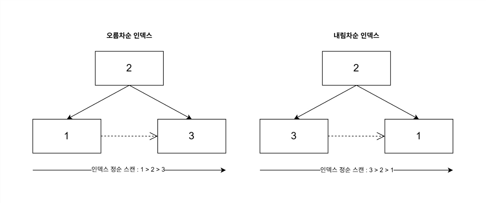

## 다중 칼럼 인덱스

보통 실전에서 사용되는 인덱스는 2개 이상의 칼럼을 포함하는 인덱스가 더 많이 사용된다.

그러므로 우리는 다중 인덱스에 대해서 명확하게 익혀야 한다!

여기서 중요한 것은, 인덱스는 항상 **왼쪽 인덱스**에 의존하여 정렬된다는 것이다.

즉, 두 번째 인덱스는 첫 번째 인덱스에 의존해서 정렬되고 세 번째 인덱스는 두 번째 인덱스에 의존해서 정렬되는 방식을 띈다.

즉, 중요한 것은 두 번째 칼럼의 정렬은 첫 번째 칼럼이 똑같은 레코드에서만 의미가 있다는 것이다.

> 🌟 그러므로 다중 컬럼 인덱스에서는 인덱스 내에서 각 컬럼의 위치(순서)가 상당히 중요하며, 그것을 아주 신중히 결정해야 한다는 것이다.

### 인덱스의 스캔 방향

다음의 쿼리를 실행할 때 인덱스가 어떻게 스캔 되는지를 알아보자.

```sql
SELECT * 
FROM employees
ORDER BY first_name DESC
LIMIT 1;
```

MYSQL 옵티마이저는 이미, 내림차순으로 정렬되어 있는 것에 대해서는 역순으로 읽어야 최적이라는 것을 알고 있다. 그러므로 위의 쿼리는 인덱스를 역순으로 접근해 첫 번째 레코드만 읽으면 한 번의 읽기로 쿼리에 대한 결과를 가져오는 것이 가능하다.

즉, 인덱스 생성 시점에 오름차순 또는 내림차순으로 정렬이 결정되지만, 쿼리가 그 인덱스를 사용하는 시점에 인덱스를 읽는 방향에 따라 오름차순 혹은 내림차순 정렬 효과를 추가로 얻을 수 있는 것이다.

MySQL 옵티마이저는 인덱스의 읽기 방향을 전환해서 사용하도록 실행 계획을 만들어 낼 수 있다.

### 내림차순 인덱스

그러나!! 인덱스의 리프 노드는 단방향 리스크이기 때문에 필연적으로 역순 스캔은 속도가 느리다.

이게 결정적인 이유이기는 하나, 역순 스캔이 속도가 느린 이유는 추가로 더 있다.

#### 1. 페이지 연결 구조의 문제

위에서 말했던 것과 동일한 이유이지만 자세히 설명하자면, 단방향 연결리스트이기 때문에 역순으로 스캔하려면 상위 ROOT 노드에 들르는 방식으로 해결해야 한다. 그러므로 느릴 수 밖에 없다.

#### 2. 페이지 락 처리

역순의 경우는 상위 노드를 거쳐야 하므로, 페이지 간 이동할 때 락을 획득/해제하는 과정이 정순 스캔보다 더 복잡하다.

#### 3. CPU 캐시 비효율성

정순 스캔의 경우는 메모리 접근이 순차적이어서 CPU 프래페칭이 효과적이지만, 역순 스캔은 비 순차적 메모리 접근이기 때문에 캐시 미스가 더 많이 발생한다. 즉, CPU가 패턴을 알 수 없기 때문에 문제가 발생한다는 것이다.

그래서 MySQL 8.0 부터 도입된 것이 바로 이 내림차순 인덱스이다.



이렇게 내림차순 인덱스를 활용하면, 정순 스캔으로도 원하는 내림차순 결과를 얻을 수 있다.

내림차순 인덱스의 경우, DESC를 통해 내림차순 조회하는 쿼리가 빈번하게, 실행되는 경우 더 효율적일 수 있다.

또한, 많은 쿼리가 인덱스의 앞쪽이나 뒤쪽을 집중적으로 읽어서 특정 페이지가 병목 될 것으로 예상된다면, 같은 상위의 락을 획득하기 않도록 하기 위해 쿼리에서 자주 사용되는 방향(순서)으로 인덱스를 생성하는 것이 병목 현상을 완화하는데 도움이 된다.

## B-Tree 인덱스의 가용성과 효율성

앞에서 인덱스의 요소 순서에 따라 효율성이 결정되므로, 이것이 매우 중요하다고 밝힌 바가 있다.

이를 알아보기 위해 다음과 같은 쿼리가 있다고 가정해보자.

```sql
SELECT * FROM dept_no
WHERE dept_no='d002' AND emp_no >= 10114;
```

여기서 다음의 두 복합 인덱스가 존재한다고 가정해보자.

```sql
A : INDEX(dept_no, emp_no)
B : INDEX(emp_no, dept_no)
```

앞에서 복합 인덱스의 경우, 왼쪽을 기준으로 오른쪽이 정렬된다고 말한바가 있다. 그러므로 이 두 인덱스의 결과는 다를 수 밖에 없다.

즉, A인덱스의 경우 dept_no를 고정해두고, 뒤에 10114로 시작하는 부분부터 스캔하기만 하면 딱 n번에 해당하는 건수를 정확히 가져올 수 있다. 즉, 추가적인 비교가 필요하지 않다. 왜냐하면 좁은 조건(고정 조건)인 dept_no를 기준으로 emp_no가 정렬되기 때문이다!

그러나 B인덱스의 경우, emp_no를 기준으로 dept_no가 정렬되기 때문에, emp_no를 찾아서 그 뒤를 스캔한다고 하더라도 고정 조건인 dept_no를 계속 비교해야 한다. 즉 효율적이지 않다.

이처럼 인덱스에서 작업의 범위를 결정하는 조건을 **‘작업 범위 결정 조건’** 이라고 하고, 작업의 범위를 줄이지 못하고 단순히 거름종이 역할만 하는 조건을 **‘필터링 조건’** 이라고 한다.

> 즉, 작업 범위를 결정하는 조건은 많으면 많을 수록 쿼리의 처리 성능을 높이지만, 체크 조건은 많다고 해서 (최종적으로 가져오는 레코드는 작게 만들지 몰라도) 쿼리의 처리 성능을 높여주지는 못한다. 오히려 쿼리의 실행을 더 느리게 만들때가 많기 때문에, 이를 잘 고려해서 결정해야 한다.
>

### 인덱스의 가용성

앞에서 인덱스는 ‘왼쪽’을 기준으로 한다고 설명한 바가 있다.

인덱스에 이러한 특징이 있기 때문에, 다음의 경우에 대해서는 인덱스가 효율성을 발휘하지 못한다.

```sql
SELECT * FROM employees WHERE first_name LIKE '%mer';
```

왜냐하면, 왼쪽을 특정지을 수 없기 때문이다!!

```sql
SELECT * FROM dept_emp WHERE emp_no >=10144;
```

이 경우에는, 인덱스가 (dept_no, emp_no) 칼럼 순서대로 생성되어 있다면 인덱스의 선행 칼럼인 dept_no 조건 없이 emp_no 값으로만 검색하면 인덱스를 효율적으로 사용할 수 없다.

이 인덱스 조건에 관한 것은 WHERE 절 뿐 아니라 ORDER_BY, GROUP_BY 등에도 똑같이 적용된다.

즉, 작업 범위 결정 조건으로 인덱스를 사용할 수 없는 경우는 다음의 두가지 이다

> 1. 칼럼에 대한 비교 조건이 없는 경우
> 2. 칼럼의 비교 조건이 딱 꽂는 조건이 아니어서 인덱스 사용 불가 조건중에 하나에 해당할 경우 (위의 왼쪽 문자 이스케이프 조건이나, NOT IN, BETWEEN 등이 여기 해당한다.)

예시들을 통해 이를 확실하게 정리해보자.

### 인덱스 가용성 예시

```sql
WHERE column_1 <> 2
```

답 : 인덱스를 사용할 수 없다.

```sql
WHERE column_1 = 1 AND column_2 > 10
```

답 : 1과 2 모두 범위 결정 조건이다.

```sql
WHERE column_1 IN (1,2) AND column_2 = 2 AND column_3 <= 10
```

답 : 1,2,3 모두 범위 결정 조건이다.

```sql
WHERE column_1 = 1 AND column_2 = 2 AND column_3 = IN(10,20,30) AND column_4 <> 100
```

답 : 1,2,3은 범위 결정 조건이고, 4는 체크 조건이다.

```sql
WHERE column_1 = 1 AND column_2 IN(10,20) AND column_3 = 30 AND column_4 LIKE '오선%'
```

답 : 1,2,3,4 모두 범위 결정 조건이다. '오선%'는 왼쪽이 고정이기 때문에….