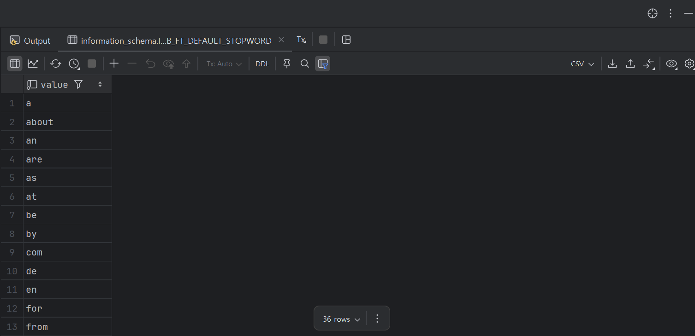

## 전문 검색 인덱스

b-tree 인덱스의 경우, 일부만을 잘라서 인덱스로 만들기 때문에, 전문 검색이 불가능하다. (contain같은) 

그래서 LIKE %키워드%와 같은 것은 검색할 수 없었던 것이다.

문서 전체에 대한 분석과 검색을 위한 이런 인덱싱 알고리즘을 전문 검색(Full Text search) 인덱스 라고 하는데, 이를 위해서는 전문 검색을 위한 인덱스를 따로 만들어서 사용해야 한다.

### 인덱스 알고리즘

전문 검색에서는 문서 본문의 내용에서 사용자가 검색하게 될 키워드를 분석해내고, 빠른 검색용으로 사용할 수 있게 이러한 키워드로 인덱스를 구축한다.

이러한 전문 검색 인덱스는 문서의 키워드를 인덱싱하는 기법에 따라 크게 단어의 어근 분석과 n-gram 분석 알고리즘으로 나눠서 구분할 수 있다.

### 어근 분석 알고리즘

어근 분석 알고리즘의 경우, 검색어에서 별 가치가 없는 단어를 모두 필터링해서 제거하는 **불용어 제거** 작업을 거친 후 어근 분석을 통해 뿌리인 원형 단어를 찾는 방식으로 이뤄진다.

그러나, 어근 분석의 경우는 단어 사전이 필요하고, 학습에도 시간이 걸리기 때문에 한글에 맞게 완성도를 갖추는 것에 많은 시간을 필요로 한다.

### n-gram 알고리즘

그래서 사용하는 것이 바로 n-gram 알고리즘이다.

n-gram이란, 본문을 무조건 몇 글자씩 잘라서 인덱싱 하는 방법으로, 여기서 n은 인덱싱할 키워드의 최소 글자수를 의미한다.

각 단어를 띄어쓰기나 공백에 따라 나눈 후, 그 안에서 n개씩을 토큰으로 생성하여 b-tree로 연결하는 방식으로 구성된다. 이때, n개의 토큰을 생성할때는 각 글자가 중첩되어 저장된다는 것이다.

서버에 내장된 불용어 리스트는 information_schema.innodb_ft_default_stopword 테이블을 통해 확인이 가능하다.



## 그럼 n-gram 전문 인덱스는 실제로 어떻게 동작하는데?

설명만 들어서는 전문 인덱스가 어떻게 동작 하는지 헷갈릴 수 있다.

직접 예시를 살펴보며 동작 원리를 익혀보자.

### 1. n-gram 파싱

```
"폭군의 블로거가 되었습니다."

→ 2글자씩 슬라이딩:
"폭군", "군의", "의 ", " 블", "블로", "로거", "거가", "가 ", " 되", "되었", "었습", "습니", "니다", "다."
```

### 2. 불용어 제거

**불용어 (Stopwords):**

- 공백을 포함한 토큰: `"의 "`, `" 블"`, `"가 "`, `" 되"`
- 특수문자만 있는 토큰: `"다."`
- 의미 없는 조사/접속사 (설정에 따라): `"의 "`, `"가 "`

```
"폭군", "군의", "블로", "로거", "거가", "되었", "었습", "습니", "니다"
```

### 3. B-Tree에 저장

```
B-tree 구조:
┌────────────────────────────────────┐
│         Root Node                  │
│    [거가, 되었, 로거, ...]           │
└────────────────────────────────────┘
         │        │        │
    ┌────┘        │        └────┐
    ▼             ▼              ▼
┌───────┐    ┌───────┐      ┌───────┐
│ "거가" │    │ "되었" │     │ "로거" │
├───────┤    ├───────┤      ├───────┤
│Doc:1  │    │Doc:1  │      │Doc:1  │
│Pos:7  │    │Pos:10 │      │Pos:5  │
└───────┘    └───────┘      └───────┘

```

각 토큰마다…..

- 문서 ID (어느 문서에 있는지)
- 위치 정보 (문서 내 몇 번째 위치)가 존재한다.

### 4. “블로거”를 검색

```
// 사용자 입력: "블로거"

// 1단계: 검색어를 n-gram 파싱
"블로거" → ["블로", "로거", "거"]  // 불용어 제거 없이 파싱

// 2단계: B-tree에서 각 토큰 조회
인덱스["블로"] → {문서1: [위치4]}
인덱스["로거"] → {문서1: [위치5]}
인덱스["거"]   → {문서1: [위치6, 위치7...]} // "거가"의 "거"도 포함

// 3단계: 연속성 체크
문서1에서:
  - "블로"가 위치4에 있고
  - "로거"가 위치5에 있고  (4+1 = 5 ✓)
  - "거"가 위치5 다음에 있나? (5+1 = 6, "거가"의 위치 ✓)
  
→ "블로거"가 연속으로 존재! → 문서1 반환
```

### 4-2. 추가) "블로 되었" 검색 (띄어쓰기 포함)

```
// NATURAL LANGUAGE MODE
"블로 되었" → ["블로", "되었"]  // 공백 무시하고 파싱

// B-tree 조회
인덱스["블로"] → {문서1: [위치4]}
인덱스["되었"] → {문서1: [위치8]}

// 두 토큰 모두 존재 → 관련도 점수 계산 → 문서1 반환
// (연속성 체크 안 함, 둘 다 있으면 OK)
```

이런식으로 검색 되어 띄어쓰기가 포함된 경우도 검색이 가능해지는 것이다.

> 🌟 즉, 전문 검색은 다음의 순서로 이어진다.
>
> 1. 우선, n개씩 토큰을 파싱한다.
> 2. 그 다음 불용어를 없앤다.
> 3. 불용어가 없는 토큰을 문서 id, 위치 값과 함께 b-tree에 저장한다.
> 4. 키워드가 들어오면 키워드도 n개씩 토큰화 한다.
> 5. 키워드에 맞는 값을 b-tree에서 찾아서 문서 안에서 **연결 되어 있어서 키워드가 존재하는지를 본다.
> 6. 띄어쓰기가 있을 경우, 관련도 점수를 계산해서 따지는 식으로 연속성을 체크하지 않는다.**
>

## 실습 결과 

- 키워드 : 894

```
http://localhost:8085/api/logs/performance/full?keyword=894
```

```json
{
    "likeSearchTime": 187,
    "fullTextSearchTime": 40,
    "likeResultCount": 300,
    "fullTextResultCount": 300,
    "performanceImprovement": 78.6096256684492,
    "testDescription": "현재 전문 인덱스 상태",
    "keyword": "894"
}
```