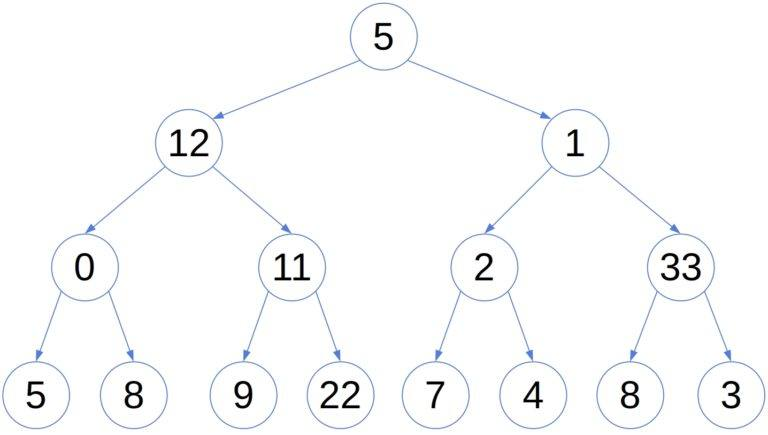

## B-Tree가 뭔데?

**Balanced Tree**란, 모든 리프 노드(leaf node)가 같은 깊이(depth)에 있다는 것을 의미한다.

균형 트리를 인덱스로 사용하는 이유는, 균형이 깨져버리면 탐색 시간이 O(log n)이 아니라 O(n)이 되어 버리기 때문이다.

균형 트리는 순서를 node 순서에 따라 트리를 유지할 뿐 아니라, 높이를 관리한다! 이를 통해 항상 삭제, 추가를 하고 난 다음에도 높이를 O(log n)으로 유지하는 것이다.

B-Tree의 경우:

- 맨 끝 자식 노드 → **리프 노드**
- 맨 최상위 부모 노드 → **루트 노드**
- 그 외 중간 노드 → **브랜치 노드**

---

## 구조 및 특성

### 기본 구조

- 데이터베이스에서 인덱스와 실제 데이터가 저장된 데이터베이스는 따로 관리된다.
- 인덱스의 리프 노드는 항상 실제 데이터 레코드를 찾아가기 위한 주소값을 가지고 있다.
- 인덱스의 키 값은 정렬되어 있지만, 레코드 값이 정렬되어 있는 것은 아니다.
    - 레코드가 삭제되어 빈 공간이 생길 경우, 그 다음의 INSERT는 가능한 한 삭제된 공간을 재활용하도록 DBMS가 설계되기 때문에 항상 INSERT된 순서대로 저장되는 것이 아니다.

### MyISAM vs InnoDB

**MyISAM**

- 세컨더리 인덱스에 물리적 주소값이 저장되어 있다.
- 인덱스에서 바로 데이터 파일의 레코드를 찾아갈 수 있다.

**InnoDB**

- 세컨더리 인덱스에 PK 값이 저장되어 있다.
- 데이터 파일의 레코드를 찾아가기 위해서는 PK 인덱스의 리프 페이지에 저장되어 있는 레코드를 읽기 위해 PK를 저장하고 있는 B-Tree를 한 번 더 거쳐서 데이터 파일 레코드를 찾아야 한다.

---

## InnoDB가 어디서 유리한건데?

### 1. 데이터가 자주 변경될 때 (UPDATE)

- **MyISAM**: 데이터의 물리적 주소가 저장되므로, 레코드가 물리적으로 이동하면(즉, UPDATE로 크기 변경 등으로 차지하는 주소 범위값이 바뀔 경우) 모든 세컨더리 인덱스의 물리적 주소를 업데이트해서 미뤄줘야 한다.
- **InnoDB**: PK만 저장하면 되므로, 신경 쓸 필요가 없다.

### 2. PK로 자주 조회할 때

- InnoDB는 PK 인덱스(클러스터드)에 실제 데이터가 함께 저장된다.
- 즉, 한 번의 탐색으로 바로 조회가 가능하다.

### 3. 범위 검색이 많을 때

- **InnoDB**: PK 순서대로 물리적으로 저장되어 있으므로, 연관된 데이터가 디스크에서 가까이에 있어 찾기 쉽다.
- **MyISAM**: 데이터가 삽입 순으로 저장되므로 범위 검색 시 가까이에 있다는 보장이 없다.

> 🌟 **즉, 이러한 이점 때문에 MySQL 역시 5.5 이후부터는 InnoDB를 기본으로 채택하였다.**

---

## B-Tree 인덱스 키 추가 및 삭제

B-Tree가 높이가 O(log n)이기 때문에 SELECT 면에서 이점이 있다는 것은 당연한 것이고, 그렇다면 인덱스의 키 추가나 삭제가 어떻게 이루어지는지를 알아두면 쿼리의 성능을 쉽게 예측할 수 있다.

### 인덱스 키 추가

새로운 키 값이 B-Tree에 저장될 때, 테이블의 스토리지 엔진에 따라 새로운 키 값이 즉시 인덱스에 저장될 수도 있고, 그렇지 않을 수도 있다(InnoDB의 경우는 지연이 가능하기 때문이다).

저장될 위치가 결정된 후에는 레코드의 키 값과 레코드의 주소 정보가 B-Tree의 리프 노드에 저장되는데, 이때 **리프 노드가 꽉 차서 더 이상 추가할 곳이 없을 때는 리프 노드가 분리되어야 한다.**

이는 상위 브랜치 노드까지 처리의 범위가 넓어지는데, 즉, 이 작업을 처리하기 위해서는 상위까지 올라가야 하므로 상대적으로 쓰기 작업(새로운 키를 추가하는 작업)에 비용이 많이 들어간다.

왜냐하면, 일단 리프 노드를 추가했으니 분기를 분리해서 늘려야 하는데, 그러려면 상위 노드로 전파되어야 분기가 가능하기 때문이다.

InnoDB의 경우 이 품이 많이 드는 삽입 작업을 미룰 수 있는데, **프라이머리 키나 유니크 인덱스의 경우는 중복 체크가 필요하기 때문에 즉시 B-Tree에 추가하거나 삭제하는 방식을 사용한다.**

### 인덱스 키 삭제

삭제 시에는 해당 키 값이 저장된 B-Tree의 리프 노드를 찾아서 그냥 **삭제 마크만 하면 작업이 완료**된다.

인덱스 키 삭제로 인한 마킹 작업 또한 디스크 쓰기가 필요하므로, 이 작업 역시 디스크 I/O가 필요한 작업이다.

### 인덱스 키 변경

인덱스 키 값에 따라 리프 노드의 위치가 결정되므로, B-Tree의 키 값이 변경되는 경우에는 **단순히 키 값을 변경하는 것이 아니라 먼저 키 값을 삭제한 후, 다시 새로운 키 값을 추가하는 형태로 처리된다.**

왜냐하면 앞에서 말했듯이 **B-Tree는 높이를 관리할 뿐 아니라 항상 정렬된 구조를 유지하기 때문에** 키 값을 변경하면 리프 노드의 위치가 바뀔 수밖에 없다.

### 인덱스 키 검색

인덱스를 구성할 경우 INSERT, UPDATE, DELETE 작업을 할 때 인덱스 관리에 따르는 추가 비용이 든다. 이 비용을 감당하면서 인덱스를 구축하는 가장 큰 이유는 바로 **빠른 검색을 위해서**이다.

참고로, B-Tree 인덱스 자체가 값의 앞부분 또는 값을 인덱스로 가져와서 맞추는 식이므로, 인덱스의 키에 해당하는 값에 변형이 있다면 인덱스를 이용할 수 없다.

> 🫵🏻 **즉, 함수나 연산을 수행한 결과로 정렬한다거나 검색하는 작업은 인덱스를 이용할 수 없으니 주의하도록 하자.**

---

## B-Tree 인덱스 사용에 영향을 미치는 요소

B-Tree 인덱스는 인덱스를 구성하는 칼럼의 크기와 레코드의 건수, 유니크한 인덱스의 키 값의 개수 등에 의해 검색이나 변경 작업의 성능이 영향을 받게 된다.

### 1. 인덱스 키 값의 크기

InnoDB 스토리지 엔진은 디스크에 데이터를 저장하는 가장 기본 단위를 **페이지(Page) 또는 블록**이라고 한다. 이는 디스크의 모든 읽기 및 쓰기 작업의 최소 작업 단위가 되며, 버퍼링 단위이기도 하다.

인덱스의 크기는 대략 **16KB가 기본적인 단위**인데, 여기서 인덱스 키 값의 크기가 커져버리면 한 번에 보관할 수 있는 레코드의 크기가 줄어들어 버린다.

즉, 인덱스를 구성하는 키 값의 크기가 커지면 디스크로부터 읽어야 하는 횟수가 늘어나고, 그만큼 느려지기 때문에 주의해야 한다.

**즉, 메모리 효율이 떨어진다!**

### 2. B-Tree 깊이

깊이는 직접 제어할 방법이 없지만, 키 크기가 커져서 한 번에 저장할 수 있는 레코드의 크기가 작아질 경우 깊이가 깊어져서 디스크 읽기가 더 많이 필요해지는 문제가 발생할 수 있다.

**그래서 키 크기를 적절하게 잘 잡아야 한다!**

### 3. 선택도 (기수성)

유니크한 값의 개수를 **기수성(Cardinality)** 이라고 한다. 그리고 기수성과 항상 정방향의 관계를 가지는 게 바로 **선택도(Selectivity)** 이다.

기수성이 높아서 유니크한 값의 개수가 많을 경우 인덱스의 정확도와 성능이 올라간다.

예를 들어, 10,000건의 데이터에 기수성이 10이라면 100개의 데이터를 읽어오는데, 하나의 정답을 위해 99개의 쓸데없는 값을 읽은 셈이 되는 것이다.

이처럼 인덱스에서 유니크한 값의 개수는 인덱스나 쿼리의 효율성에 큰 영향을 미친다.

### 4. 읽어야 하는 레코드의 건수

인덱스를 통해 테이블의 레코드를 읽는 것은 인덱스를 거치지 않고 바로 테이블의 레코드를 읽는 것보다 높은 비용이 드는 작업이다.

보통은 인덱스를 통해 테이블을 읽는 것이 그냥 테이블을 읽는 것보다 **4~5배의 품이 더 든다**고 얘기하는데, 즉, **인덱스를 통해 읽어야 할 레코드의 개수가 20~25%를 넘어서면 인덱스를 이용하지 않고 테이블을 직접 스캔하는 것이 좋다.**

예를 들어, 100개의 데이터에서 50개를 읽어야 한다면 전체의 50%에 해당하므로 인덱스를 사용하지 않는 것이 더 좋다.